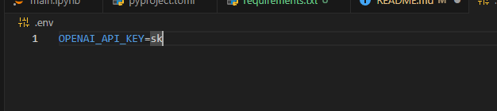

# Choi Chatbot
## Setting Up Instruction and Running
### Setup environment
- If you are using `poetry` you can start with:
```bash
poetry shell
poetry install
```
- Then you are done with python dependencies installation.
- But if you don't have `poetry` that ok too you can use pip to install dependencies from `requirments.txt` file as well.
```bash
pip install -r requirements.txt
```

- or using conda to create new environment.
```bash
conda create -n test python=3.11 -y
conda activate test
pip install -r requirements.txt
```

- Remember to use python version `^3.11`.

### Setup OpenAI credential
- Export OpenAI token by using:
```bash
cp .env.development .env
```
- Then go the new created file `.env` to add your OpenAI token:

- Put your key after equal sign.

### Start running
- After complete install dependecies, you can now start running the chatbot.
- run these commands to start chatbot.
```bash
set -a
source .env
python frontend/front_end.py
```

- Then go to this link to use chatbot's user interface: http://127.0.0.1:7861/